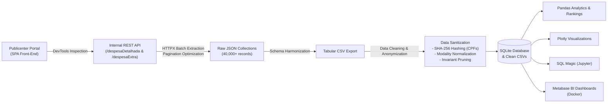

# Publicenter Transparency Portal - Data Extraction, Pipeline & Analytics

A data engineering and analytics project that extracts, cleans, anonymizes, and analyzes public spending data from Brazilian municipal transparency portals powered by **Publicenter**. 

The project features an end-to-end pipeline in a Jupyter Notebook ([`project.ipynb`](project.ipynb)), taking raw public data from reverse-engineered REST APIs through LGPD-compliant data anonymization, multi-paradigm analysis (Pandas & SQL), and interactive Business Intelligence dashboards with **Plotly** and **Metabase**.

---

## 📌 Case Study & Context

In Brazil, the Access to Information Law (*Lei de Acesso à Informação* - LAI) and Fiscal Responsibility Law (*Lei de Responsabilidade Fiscal* - LRF) mandate all government entities to provide public spending and budget execution data through transparency portals. 

Many Brazilian municipalities contract third-party software vendors to host these portals. One prominent vendor is **Publicenter**. This project uses the municipality of **Lagoa Formosa, Minas Gerais (MG)** as a case study:
- **Target Portal**: [Lagoa Formosa Transparency Portal](https://transparencia.lagoaformosa.mg.gov.br/#/transparencia)
- **Scope**: Budgetary expenditures (*Despesa Orçamentária*) and off-budgetary expenditures (*Despesa Extraorçamentária*) spanning over 15 years (2010–2026).

---

## 🚀 Key Pipeline Stages ([`project.ipynb`](project.ipynb))



### 1. Reverse Engineering the REST API
- Inspecting browser Network Developer Tools to intercept backend API calls behind the single-page application (SPA).
- Identified endpoints for detailed budgetary expenses (`/publico/despesaDetalhada`) and off-budgetary expenses (`/publico/despesaExtra`).
- **Pagination Optimization**: Adjusted query parameters (`elementosPorPagina`) from default 20 to 10,000, shrinking total HTTP requests from **2,025 requests down to just 5 requests**, significantly speeding up ingestion while avoiding rate limiting.

### 2. Ingestion & Tabular Transformation
- Automated data harvesting using `httpx`.
- Handled heterogeneous JSON schemas by building dynamic key union sets across all records to guarantee complete column coverage.
- Structured the raw data into tabular format.

### 3. Data Cleaning & LGPD / Privacy Protection
- **Personal Data Protection**: Detected sensitive individual identification numbers (Brazilian **CPF**, equivalent to US SSN) via regex matching.
- **Irreversible SHA-256 Anonymization**: Hashed all CPF entries to protect individual privacy while preserving relational grouping and aggregation integrity for suppliers.
- **Schema Normalization**:
  - Pruned empty rows, fully null columns, and invariant columns (`nunique() <= 1`).
  - Standardized redundant procurement modality categories (`desModalidade`) using equivalence dictionaries (e.g., consolidating `DISPENSA`, `Dispensada` into `Dispensa`).
- Persisted sanitized datasets into `extractedBudgetaryData.csv`, `extractedOffBudgetaryData.csv`, and a relational `portalDaTransparencia.sqlite` database.

### 4. Analysis & Key Insights
- **Top Supplier Rankings**:
  - Top municipal beneficiaries ranked by total funding received, transaction frequency, and average payout per transaction (annually and across the entire historical period).
- **Public Procurement Modality Breakdown**:
  - Tracked procurement methods (*Dispensa*, *Inexigibilidade*, *Pregão*, *Convite*, etc.) over time.
  - **Key Insight**: Revealed that **"Dispensa de Licitação" (Bidding Waiver)** was by far the predominant procurement method used across every single analyzed year.

### 5. Multi-Tool Visualization & BI
- **Interactive Plotting**: Generated historical modality timelines and spending breakdowns using `plotly.express`.
- **In-Notebook SQL**: Queried the SQLite database directly using `ipython-sql` (`%sql` / `%%sql` magic).
- **Self-Hosted Metabase Dashboard**: Provided step-by-step instructions to spin up a Metabase instance in Docker, mount the SQLite database, and build interactive dashboards and metrics.

---

## 📂 Repository Structure

```plaintext
├── project.ipynb                    # Primary notebook containing the complete pipeline
├── requestsStudy.ipynb              # Exploratory notebook for HTTP request testing
├── portalDaTransparencia.sqlite     # Processed SQLite database containing sanitized tables
├── extractedBudgetaryData.csv       # Anonymized budgetary expenditure dataset
├── extractedOffBudgetaryData.csv    # Anonymized off-budgetary expenditure dataset
└── documentation/
    └── images/                      # Documentation screenshots (API headers, plots, Metabase)
```

---

## 🛠️ Technologies Used

- **Language & Environment**: Python, Jupyter Notebook
- **HTTP Client**: `httpx`
- **Data Wrangling**: `pandas`, `csv`, `re`, `hashlib`
- **Relational Storage & SQL**: `sqlite3`, `ipython-sql`, `prettytable`
- **Data Visualization**: `plotly.express`
- **Business Intelligence**: `Metabase` running via `Docker`

---

## 🚦 Getting Started

### 1. Clone the Repository
```bash
git clone https://github.com/gbrielgustavo/portal-transparencia-publicenter.git
cd portal-transparencia-publicenter
```

### 2. Install Dependencies
```bash
pip install httpx pandas plotly ipython-sql prettytable jupyter
```

### 3. Run the Notebook
Launch Jupyter and open [`project.ipynb`](project.ipynb):
```bash
jupyter notebook project.ipynb
```

### 4. Optional: Run Metabase with Docker
To view or build dashboards connected to the SQLite database:
```bash
docker run -d \
  --name metabase \
  --restart unless-stopped \
  -p 3000:3000 \
  -v $(pwd):/data:Z \
  -v metabase-data:/metabase-data \
  metabase/metabase:latest
```
Access Metabase at `http://localhost:3000`, add a new **SQLite** database, and set the path to `/data/portalDaTransparencia.sqlite`.

---

## ⚖️ Legal & Privacy Disclaimer

All data analyzed in this repository is public information sourced directly from the official municipal transparency portal pursuant to Brazilian Federal Law No. 12.527/2011 (*Lei de Acesso à Informação*). In adherence to the Brazilian General Data Protection Law (*Lei Geral de Proteção de Dados* - LGPD, Law No. 13.709/2018), natural person identifiers (CPFs) have been anonymized using cryptographic SHA-256 hashing prior to publication.
